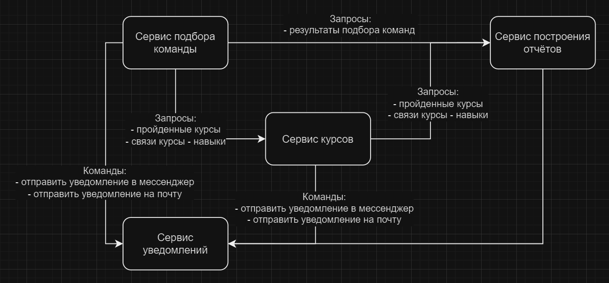

Сервис управления развитием сотрудников

Бизнес потребности:
- отслеживание прогресса по курсам сотрудников
- создание плана развития сотрудника
- подбор сотрудников на проект
- создание отчётов

Пользовательские истории:

```
История 1: Управление галерей курсов доступных компании

Как менеджер
Чтобы управлять развитием навыков у сотрудников
Я хочу видеть какие курсы есть у компании

Сценарий 1: Просмотр курсов
Дано, то что ранее в галерее есть набор курсов
Когда менеджер запрашивает информацию о курсах
Тогда в ответ он получает курсы, их рейтинг и отзывы коллег

Сценарий 2: Добавление курсов в галерею
Дано, то что ранее в галерее было 3 курса
Когда менеджер добавляет новый курс
Тогда в галерее должно стать 4 курса, включая добавленный
```

```
История 2: Создание плана развития сотрудника

Как менеджер
Чтобы управлять развитием навыков у сотрудников
Я хочу составить план, состоящий из курсов доступных компании

Сценарий 1: Создание плана
Дано: галерея содержит набор курсов
Когда менеджер отправляет запрос на создание плана
Тогда план становится доступным для просмотра сотруднику
И сотруднику приходит уведомление о добавлении плана
```

```
История 3: Отслеживание прогресса прохождения курсов сотрудниками

Как менеджер
Чтобы отслеживать прогресс по выполнению плана развития сотрудников
Я хочу видеть текущий прогресс по активному курсу сотрудника

Сценарий 1: Запрос прогресса выполнения курса
Дано: сотрудник начал выполнение курса на сторонней платформе
Когда менеджер отправляет запрос на получение текущего прогресса
Тогда приложение отправляет Api запрос к обучающей платформе о предоставлении данных о текущем прогрессе
И возвращает менеджеру данные о прогрессе
И при желании менеджер может уведомить сотрудника о медленном прогрессе
```


```
История 4: Подбор сотрудников на проект

Как менеджер
Чтобы создвать эффективные команды для реализации проектов
Я хочу иметь систему рекомендации сотрудинков на основе пройденных курсов

Сценарий 1: Сбор команды для проекта
Дано: менеджеру необходимо собрать команду для проектам с необходимыми компетенциями
И компетенции имеют прямые связи с курсами доступными компании
Когда менеджер отправляет запрос на подбор команды, указав необходмые компетенции
Тогда приложение подбирает наиболее сбалансированную команду с учётом пройденных курсов
И если менеджер подтверждает, приложение формирует проект в Jira
И отправляет уведомление о старте нового проекта сотрудинкам
```


```
История 5: Квартальные отчёты для топ-менеджемента

Как топ-менеджер
Чтобы планировать бюджет на обучение сотрудников
Я хочу создавать отчёты о выполнении планов развития и проблемах в процессе подбора команд

Сценарий 1: Генерация отчёта о выполнении планов развития
Дано: Данные о планах развития и актуальный прогресс по прохождению курсов
Когда Топ-менеджер создаёт заявку на генерацию отчёта
Тогда приложение получает данные о планах
И запрашивает данные о текущем прогрессе выполнения
И генерирует отчёт в формате Excel
И отправляет его на почту топ-менеджера
```

### Схема взаимодействия сервисов



### Описание сервисов, зоны ответственности

#### Сервис индивидуальных планов развития (Education service)
- предоставляет информацию о курсах
- позволяет составлять индивидуальные планы развития сотрудника
- позволяет отслеживать прогресс выполнения курсов (api образовательных платформ)
- позволяет отслеживать прогресс выполнения индивидуальных планов развития

#### Сервис подбора команды (Team selection service)
- решает задачу подбора оптимальной команды для выполнения проекта на основе набора необходимых навыков
- позволяет создать команду из результатов подбора
- хранит историю запросов и решений

#### Сервис отчётов (Report service)
- готовит сводные отчёты для оценки HR-стратегии и стратегии развития сотрудников

#### Сервис уведомлений (Notification service)
- отправляет уведомления сотрудникам в мессенджер
- отправляет уведомления сотрудникам через почту